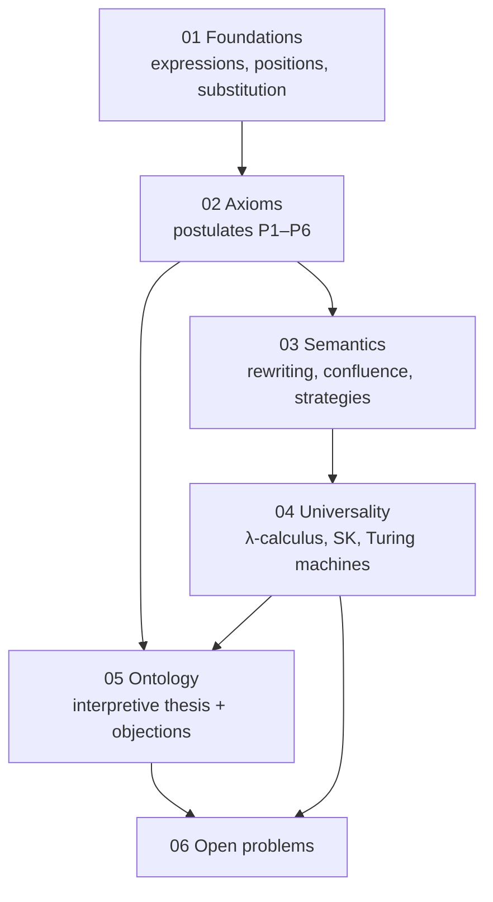

# 00 — Overview

*Status: Stable*

## 1. What this framework is

The Expression-Tree Ontology (ETO) is organized around one structural claim and one dynamical claim:

- **Structural claim.** Every state of a discrete computational system is a *finite expression* — a finite, ordered, rooted tree whose nodes are labeled by operators from a fixed signature, with each node's child count determined by its operator's arity.
- **Dynamical claim.** Every state transition of such a system is the application of a *rewrite rule* at some position in the expression.

Neither claim is novel in isolation. The structural claim is the definition of the free term algebra, standard since the algebraic treatment of syntax (Birkhoff 1935; see [bibliography](bibliography.md)). The dynamical claim is the founding idea of term rewriting systems (Baader & Nipkow 1998) and, earlier, of Post's production systems (Post 1943). What ETO contributes is:

1. A **uniform restatement** of the metatheory of computation with the expression tree, rather than the machine, the function, or the proof, as the primitive object.
2. A set of **six postulates** ([02-axioms.md](02-axioms.md)) that make the framework's commitments explicit and independently deniable — a reader can accept the mathematics while rejecting any subset of the interpretive postulates.
3. An **interpretive thesis** ([05-ontology.md](05-ontology.md)): that the expression/rewrite vocabulary is a candidate for describing what discrete physical processes are, not merely how we model them. This thesis is speculative and is presented together with the strongest objections known to the authors.

## 2. Why trees, specifically

Several formalisms are universal, so the choice of primitive is a choice of *perspicuity*, not of power. The case for expression trees:

- **Compositionality is built in.** A tree is either a leaf or an operator applied to subtrees. Every structural induction, every denotational semantics, and every syntax-directed algorithm exploits exactly this shape. Strings (Turing machines, Post systems) obscure it; graphs generalize it but forfeit unique decomposition.
- **Syntax and state coincide.** In the λ-calculus and in combinatory logic, the *program* and the *machine state* are the same kind of object — a term. ETO takes this identification as fundamental rather than incidental.
- **Locality is expressible.** A rewrite happens *at a position*. The part of the tree above and beside the redex is untouched. This gives a precise, checkable meaning to "local change," which the interpretive layer relies on.
- **The metatheory is mature.** Confluence, termination, critical pairs, and strategy theory are developed to textbook level (Baader & Nipkow 1998; Terese 2003). ETO inherits all of it.

The cost of the choice is equally real and is stated up front: ordered trees privilege a particular decomposition of state, and physical systems do not obviously come with one. This is the *representation problem*, treated honestly in [05-ontology.md §4](05-ontology.md).

## 3. Map of the framework

Documents 01–04 are self-contained mathematics. Document 05 depends on all of them. Document 06 collects what is genuinely unresolved.

## 4. What this framework is not

To prevent the most common misreadings:

- **Not a claim of new computational power.** ETO lives inside the Church–Turing equivalence class and says so ([04-universality.md](04-universality.md)). No hypercomputation is proposed.
- **Not a physics theory.** ETO makes no quantitative predictions. The interpretive layer is a philosophical proposal about the *kind* of description physics might bottom out in, in the tradition of Zuse (1969), Wheeler (1990), and Fredkin (1990) — and it inherits the open problems of that tradition, including the treatment of quantum mechanics ([05-ontology.md §5](05-ontology.md)).
- **Not a programming language.** Although the framework could be implemented directly (and an implementation is listed as future work in [06-open-problems.md](06-open-problems.md)), the documents define a theory, not a tool.

## 5. Intellectual lineage

ETO synthesizes, and is careful to credit, four traditions:

| Tradition | Key sources | What ETO takes from it |
|---|---|---|
| Term rewriting | Post 1943; Baader & Nipkow 1998; Terese 2003 | The dynamical primitive and its metatheory |
| λ-calculus & combinatory logic | Church 1936; Schönfinkel 1924; Curry & Feys 1958; Barendregt 1984 | Syntax-as-state; universality via minimal operator sets |
| Algorithmic information theory | Solomonoff 1964; Kolmogorov 1965; Li & Vitányi 2019 | Representation invariance up to additive constants |
| Digital physics / pancomputationalism | Zuse 1969; Fredkin 1990; Wheeler 1990; Wolfram 2002; critical: Putnam 1988; Chalmers 1996; Piccinini 2015 | The interpretive ambition — and its established objections |

Full citations in the [bibliography](bibliography.md).
